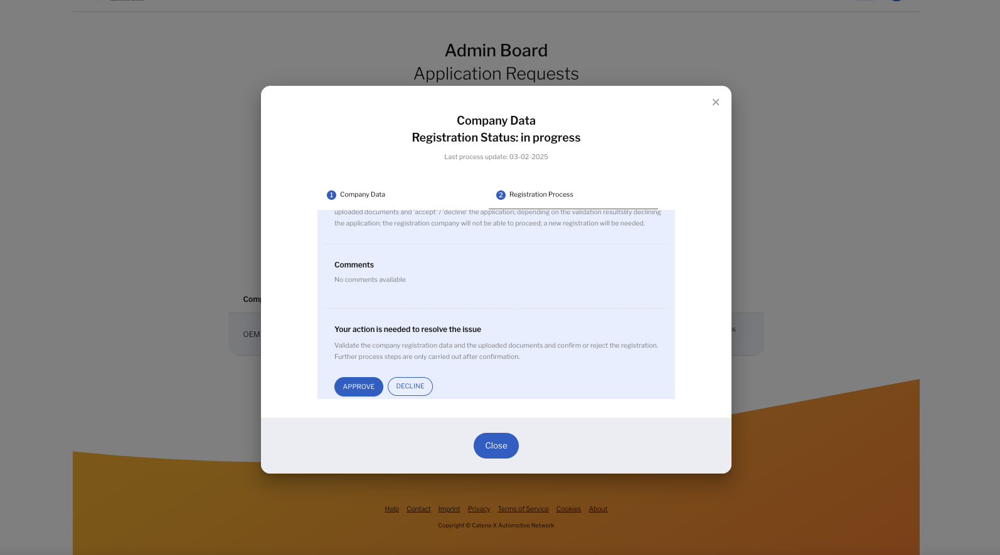

## STEP 3: Verify and Approve Registration Process

This step invloves approval process of a company. It is performed by the dataspace operator

- Login using CX-Operator company and credentials:

    
- Go to the “Application Requests” from the Menu

- In the Admin Board, you see the application requests from the participants

- Go to the “Data Validation” check and approve it

After approval, it must be green

- Click on pencil symbol and add BPN number manually.
Example: **BPNL00000000OEMA**

Refresh the web page to reflect the changes in the application checklist status.

> **Note**
> For the approval of other steps such as Wallet, BPNL and Membership Credentials, refer to the technical guide [here](./04_Technical_Steps.md).

> **Note**
Since the Clearing House and Self Description components are external components, there is currently no way to get systematic approval from these components. The community is working on a toggle to disable the calls to these components. Currently, there is a workaround to bypass these checks using the SQL queries to be executed in the backend database (See below section Technical Steps to bypass external components).

If all checks are passed and registration is approved, the company admin will be notified via email

See [technical guide](./04_Technical_Steps.md) to skip the external components and get them approved.

